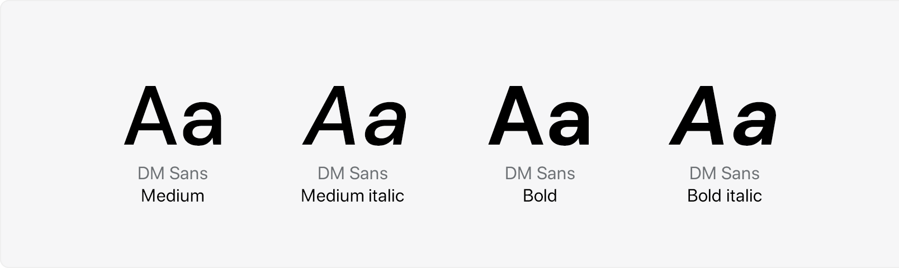
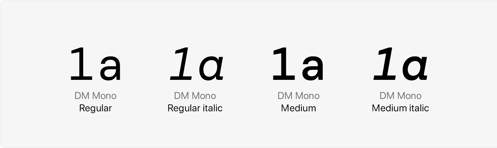
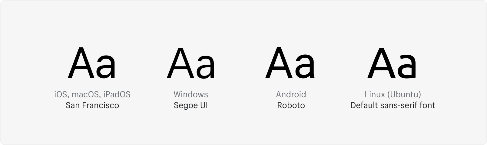

# Talk and type strong yet easy and clear

Fiskaly provides a constrained, purposeful set of typographic styles.

## Brand Font

**DM Sans** is our primary headline typeface. It has been selected for its approachability, geometry, and its clean modern look.
It’s used for titles, headlines, subheads, and short introductions. Therefore only use font-weight **Medium** or **Bold**.
DM Sans has quirks that give it a lot of warmth and friendly feel.
As a geometric font it presents a clean, simple design, representing purity and balance.

[Get DM Sans](https://fonts.google.com/specimen/DM+Sans)



## Accent Font

Pairing the geometric font with the monospace **DM Mono** gives Fiskaly the necessary appeal of developer domain.

[Get DM Mono](https://fonts.google.com/specimen/DM+Mono)



## Body Copy

We use a font stack that adapts to the operating system it runs on, like macOS, iOS, Windows, Android or Linux distributions,
to make sure all browsers can load platform-specific fonts.



- Apple devices will display [San Francisco](https://developer.apple.com/fonts/)
- Android devices will display [Roboto](https://fonts.google.com/specimen/Roboto)
- Devices running Windows will display [Segoe UI](https://en.wikipedia.org/wiki/Segoe#Segoe_UI)
- Machines running Linux will display the default sans-serif font for any running distribution

```css
-apple-system, BlinkMacSystemFont, San Francisco, Segoe UI, Roboto, Helvetica Neue, sans-serif
```
